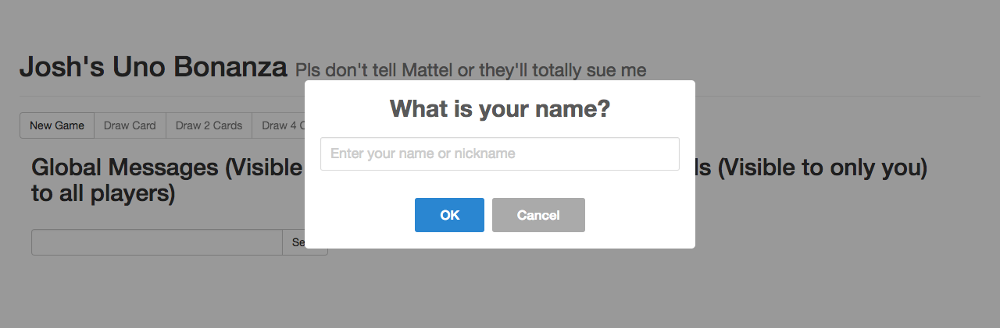
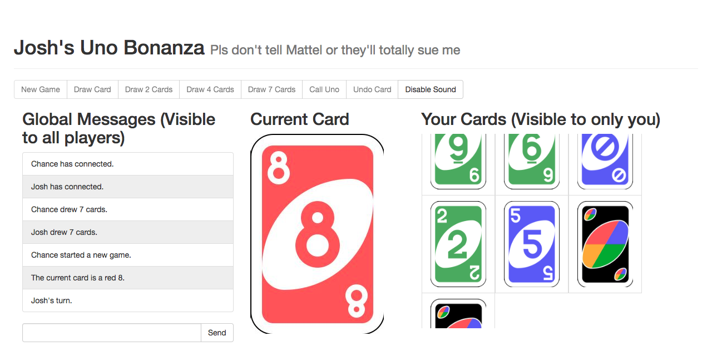
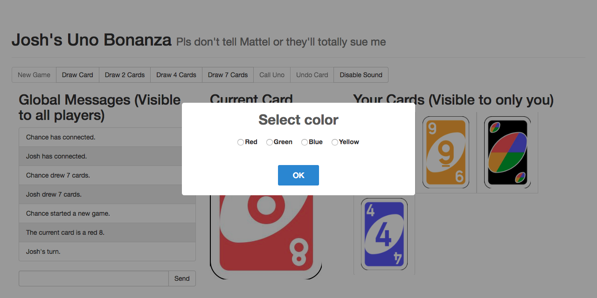
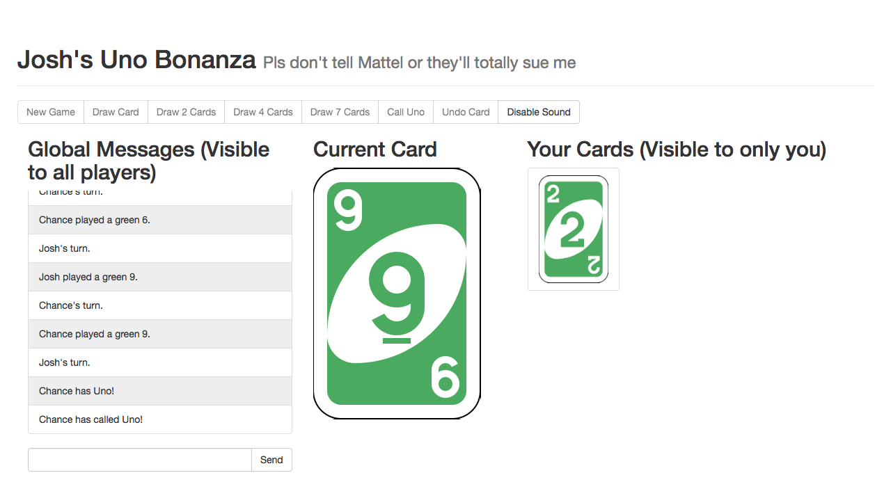
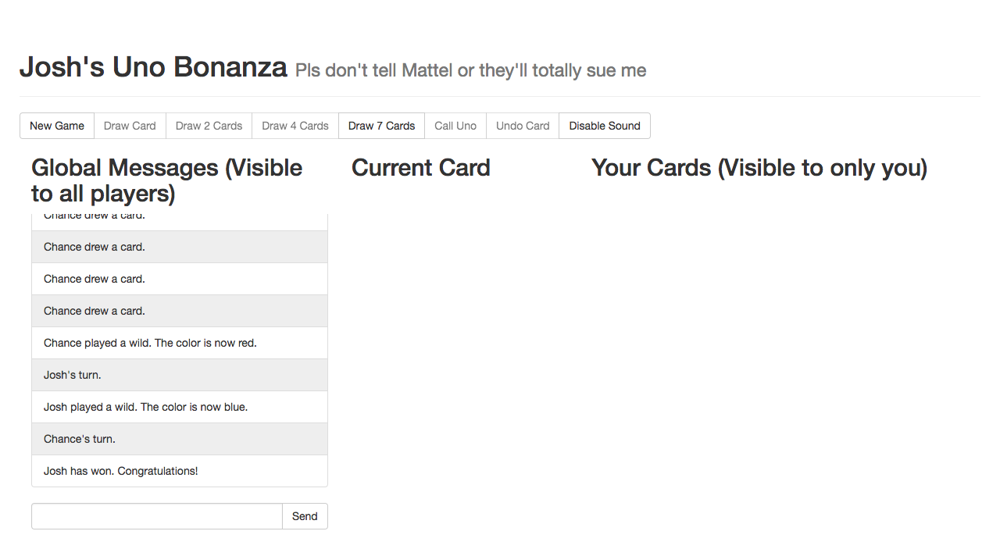

# nodeUno

This is a dope Node.js game of Uno that you can play with your friends (if you have any).

Simply visit [Josh's Uno Bonanza](https://unobonanza.azurewebsites.net) to play!

## Screenshots
Type in your name, or press `ESC` for a random name.

Press `New Game` to start a new game. The chatbox on the left-hand side lets everyone know whose turn it is.
On your turn, your screen will flash green and a "ding" will sound, if you have sound turned on.

Demonstration of color choices when a wild is played:

Make sure to call Uno when you only have one card left!
If any other players call it before you, you're penalized two cards.

When you win, the game clears, letting you play another round!

